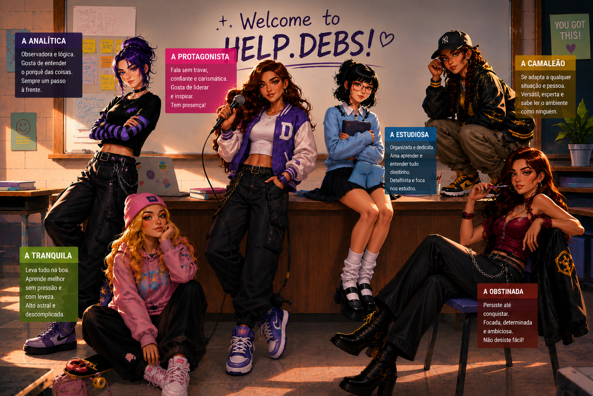

# helpdebs-portal ✨

Portal educacional interativo desenvolvido para as alunas da Help.debs, criado para transformar o aprendizado de inglês em uma experiência personalizada, visual e contínua — indo muito além de apenas assistir aulas ou baixar PDFs.



---

# 🌐 Sobre o Projeto

O helpdebs-portal é uma plataforma web criada para centralizar:

- login das alunas
- materiais
- diagnósticos
- trilhas de aprendizagem
- feedbacks
- progresso
- calendário
- experiências interativas
- personalização baseada no perfil da aluna

A ideia do projeto é criar um ambiente que funcione como uma extensão da experiência das aulas da Teacher Debs.

---

# ✨ Principais Funcionalidades

## 🔐 Sistema de Autenticação

- Cadastro de conta
- Login
- Recuperação de senha
- Persistência de usuário
- Integração com Supabase Auth

Arquivos:

```bash
login.html
signup.html
trocar_senha.html
```

---

## 🧠 Diagnósticos Inteligentes

A plataforma utiliza testes para entender:

- nível da aluna
- personalidade
- interesses
- objetivos

Esses dados alimentam partes do próprio sistema futuramente.

Arquivos:

```bash
teste-personalidade.html
teste_nivelamento.html
interesses.html
personagens.html
```

---

## 🎭 Sistema de Personalidade

Após realizar o teste, a aluna recebe:

- um tipo de personalidade
- descrição
- forças
- estilo de aprendizagem
- personagem visual personalizado

Objetivo:
transformar o estudo em algo mais emocional, visual e imersivo.

---

## 📚 Área da Aluna

A dashboard principal foi criada para reunir:

- materiais
- próximos passos
- foco da semana
- progresso
- calendário
- notificações
- trilha de evolução

Arquivo:

```bash
portal.html
```

---

## 🛠️ Painel Administrativo

Área utilizada para:

- gerenciar alunas
- acompanhar diagnósticos
- visualizar informações
- administrar conteúdos

Arquivo:

```bash
admin.html
```

---

# 🎨 Identidade Visual

O portal segue a identidade visual da Help.debs:

- kawaii
- y2k
- soft UI
- inspiração em Windows XP
- tons de:
  - roxo
  - azul bebê
  - amarelo claro
  - branco

Objetivo:
criar um ambiente acolhedor, divertido e memorável.

---

# ⚙️ Tecnologias Utilizadas

## Front-end

- HTML5
- CSS3
- JavaScript Vanilla

## Back-end / Banco

- Supabase
- Supabase Auth
- Supabase Database

## Hospedagem

- GitHub Pages

---

# 🧩 Estrutura do Projeto

```bash
helpdebs-portal/
│
├── admin.html
├── index.html
├── login.html
├── signup.html
├── portal.html
├── personagens.html
├── interesses.html
├── teste-personalidade.html
├── teste_nivelamento.html
├── trocar_senha.html
│
├── personagens_helpdebs.png
│
└── assets/
```

---

# 🚀 Objetivos do Projeto

O projeto busca criar:

- uma experiência personalizada de aprendizagem
- um portal vivo e interativo
- um ambiente que se adapta à aluna
- um sistema educacional emocionalmente envolvente
- uma mistura entre educação, design e tecnologia

---

# 🔮 Funcionalidades Futuras

## 📈 Progresso Inteligente

- sistema de XP
- streaks
- níveis
- desbloqueios

## 🧠 IA Integrada

- feedback automático
- sugestões de estudo
- análise de escrita
- atividades personalizadas

## 🎮 Gamificação

- trilhas estilo Duolingo
- missões
- badges
- personagens evolutivos

## 📱 PWA Completa

- instalação no celular
- notificações push
- funcionamento mais fluido no mobile

---

# 💡 Filosofia do Projeto

> aprender inglês deveria parecer entrar em um universo, não apenas abrir um PDF.

---

# 👩‍💻 Desenvolvido por

### Débora Moreira

Professora de inglês + estudante de Engenharia de Software

Projeto criado como ponte entre:

- educação
- experiência do usuário
- programação
- personalização de ensino

---

# 📌 Status Atual

🚧 Em desenvolvimento ativo

Atualmente:

- front-end funcional
- integração com banco em andamento
- refinamento de experiência e sistema de dados

---

# 📷 Preview

## Login

- autenticação de usuário
- acesso personalizado

## Testes

- personalidade
- nivelamento
- interesses

## Portal

- dashboard da aluna
- experiência centralizada

## Personagens

- representação visual do perfil da aluna

---

# 🖥️ Rodando Localmente

Clone o projeto:

```bash
git clone https://github.com/seuusuario/helpdebs-portal.git
```

Abra:

```bash
index.html
```

---

# ❤️ Observação

Esse projeto começou como uma ideia simples para organizar aulas.

Hoje, ele já funciona como o início de um ecossistema educacional personalizado.
